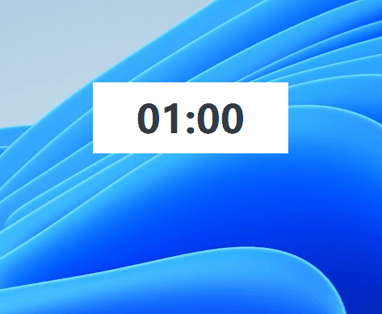

## StopWatch

*A simple timer that can be used for PowerPoint presentations.*

- Supports sequential timing and countdown from 1 to 60 minutes.
- Emphasizes the last 10 seconds (text turns red and a sound is played).
- Supports window always on top and auto-hide option.
- F1: About
- F5: Start/Pause, same as PPT play hotkey.
- F6: Reset
- ESC/Alt+F4: Exit (can only be done when the window is in focus to avoid accidental closing).

### Homepage
[Github](https://github.com/funchan24/StopWatch)

### Donate
If you like it or find it useful, Maybe you could [By me a coffee](https://bmc.link/funchan7) ?

### Screenshot
